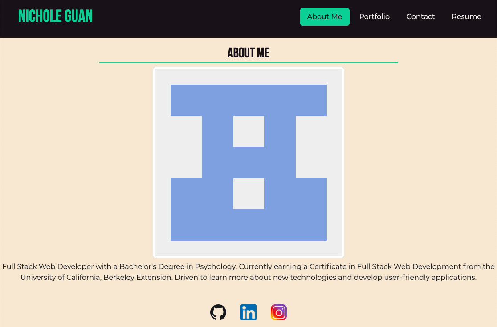

# Portfolio

[Link to Deployed Website](https://ncguan.github.io/portfolio-ng/)

## Description
The project was built to be able to create a portfolio of work samples. The portfolio contains a header with my name and a navigation bar with an About Me, Portfolio, Contact, and Resume section. When a navigation title is clicked, the corresponding section will be presented. The About Me section has an image of my avatar and a short bio of myself. The Portfolio section has images of six of my applications with links to the deployed application and GitHub repository. The Contact section has a form to fill out your name, email, and message to me. The Resume section has a list of my proficiencies and a link to download my resume.

## Technologies Used
- JavaScript
- Git
- GitHub
- Bootstrap
- React

## Usage
Click a navigation link to be presented with the corresponding section content.

## License
Please refer to the LICENSE in the repo.

## Author Links
[GitHub](https://github.com/ncguan)